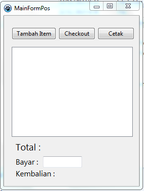

# Sistem POS Lazarus tanpa database

Ini adalah sistem Point of Sale (POS) sederhana yang diimplementasikan menggunakan Lazarus dan Free Pascal.

## Fitur

- Menambahkan item ke penjualan
- Menghitung jumlah total
- Menerima pembayaran dan menghitung kembalian
- Mencetak struk

## Persyaratan

- Lazarus IDE
- Free Pascal Compiler

## Cara Penggunaan

1. **Klon repositori:**

   ```bash
   git clone https://github.com/fajarjulyana/simple-pos-lazarus-ide.git
   ```

2. **Buka proyek di Lazarus:**

   Buka Lazarus IDE dan pilih "Open Project" dari menu File. Navigasikan ke repositori yang telah di-klon dan buka file proyek (`pos.lpi`).

3. **Jalankan aplikasi:**

   Klik tombol "Run" di Lazarus IDE atau tekan F9 untuk mengompilasi dan menjalankan aplikasi.

4. **Menambahkan item ke penjualan:**

   - Klik tombol "Tambah Item".
   - Masukkan nama dan harga item ketika diminta.

5. **Checkout:**

   - Klik tombol "Checkout".
   - Masukkan jumlah pembayaran di bidang yang disediakan.
   - Klik "OK" untuk menyelesaikan transaksi.

6. **Cetak Struk:**

   - Klik tombol "Print" untuk menampilkan struk dalam kotak pesan.



## Berkontribusi

Silakan berkontribusi pada pengembangan sistem POS ini dengan membuat isu atau mengirimkan pull request.

## Lisensi

Proyek ini dilisensikan di bawah Lisensi GPL - lihat file [LICENSE](LICENSE) untuk detailnya.
